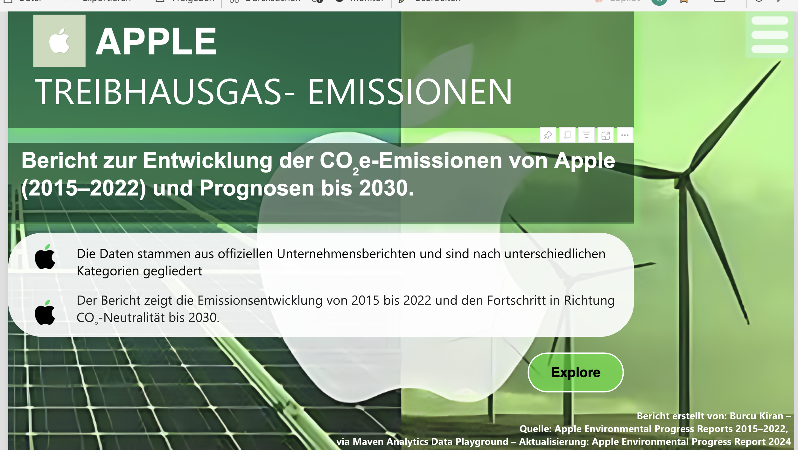
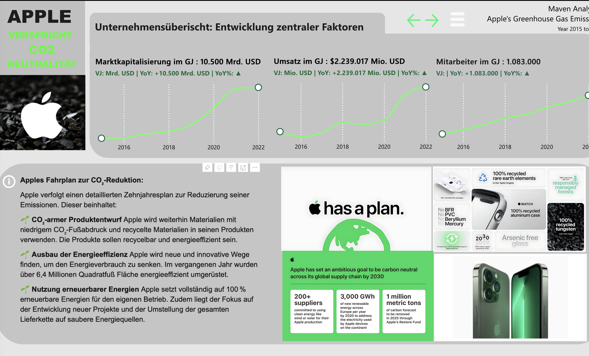
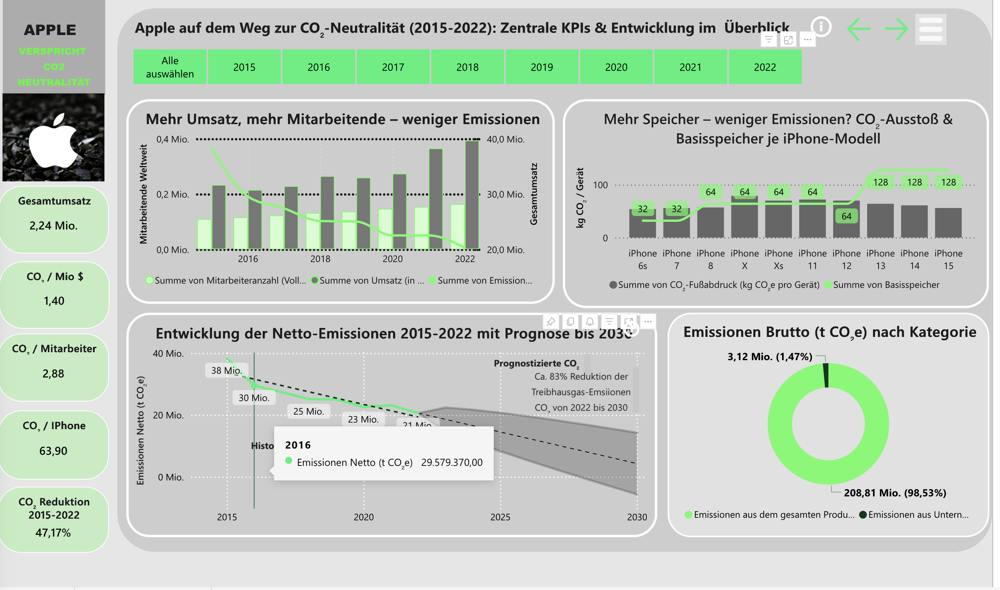
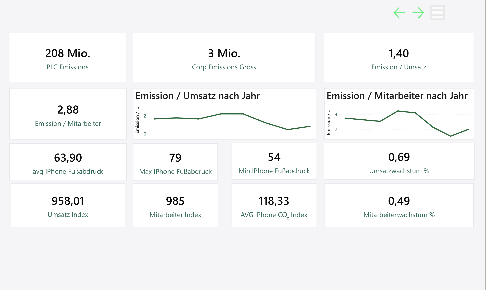
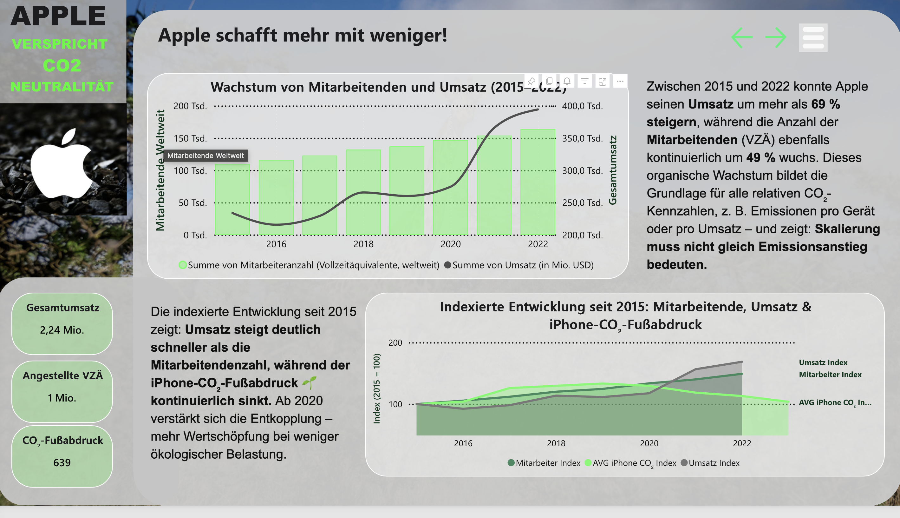
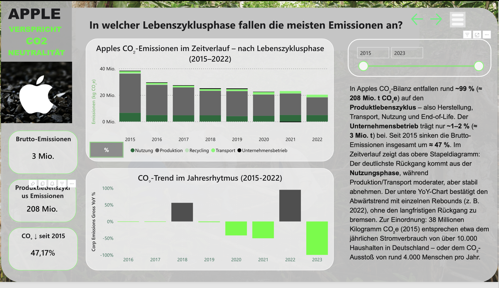
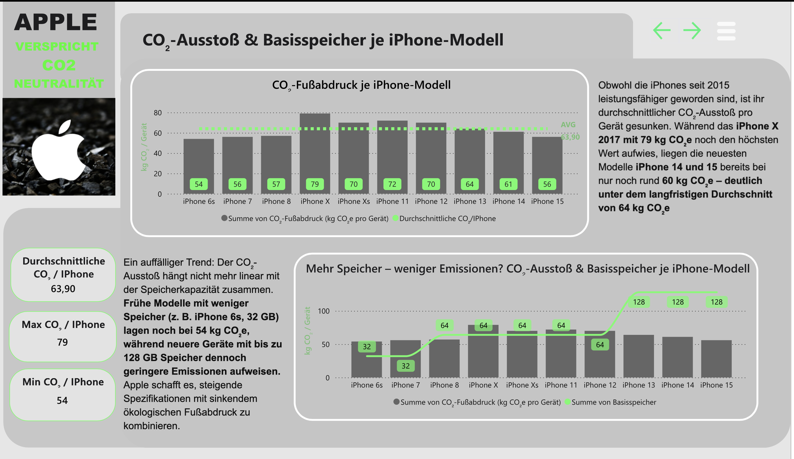
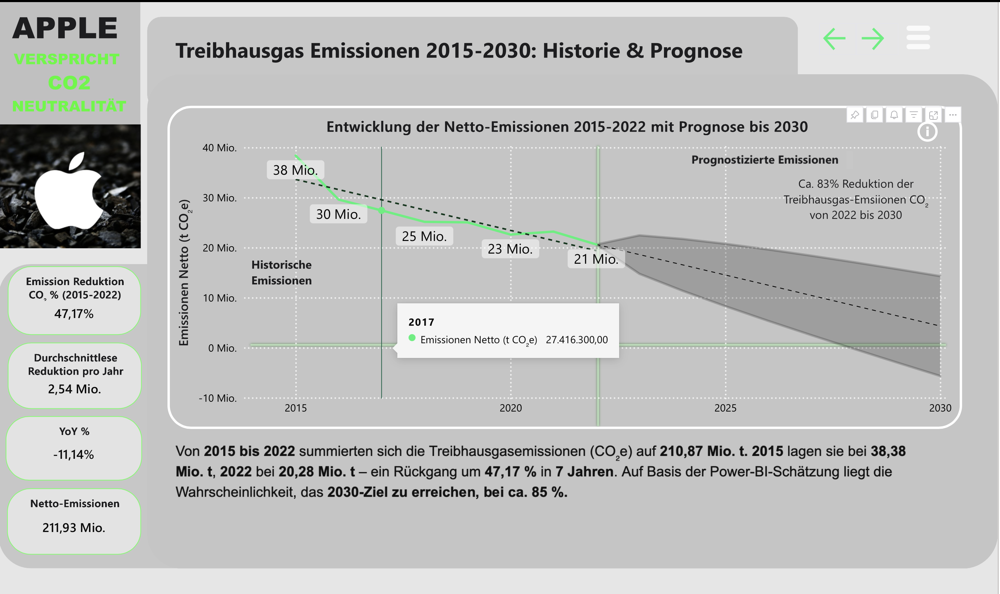
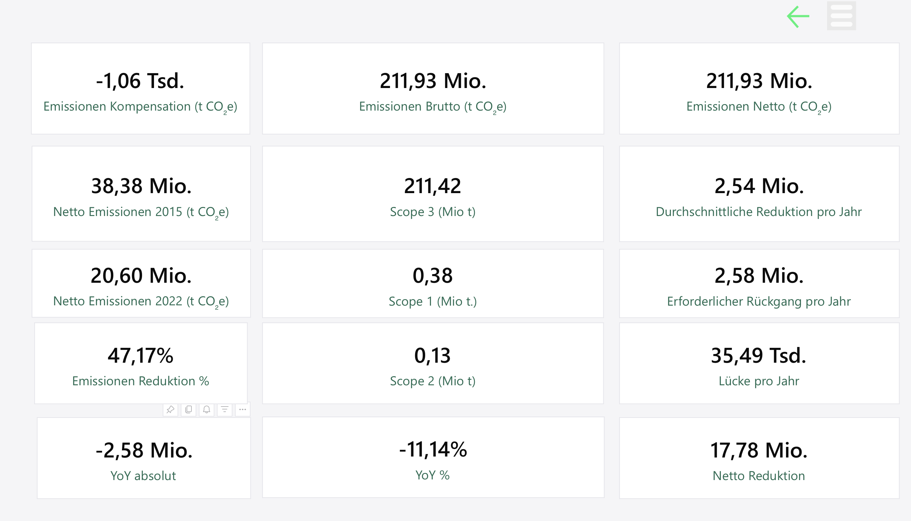

# 📊 Apple CO₂ Emissions Analysis — 2015 to 2022

A data analysis project examining Apple's carbon footprint development from 2015 to 2022 — built with Power BI. The analysis evaluates emission trends across the product lifecycle, relative efficiency gains despite company growth, and projects whether Apple is realistically on track to reach net-zero emissions by 2030.

**Tool:** Power BI  
**Data Source:** [Maven Analytics Data Playground](https://www.mavenanalytics.io/data-playground?dataStructure=Multiple%20tables&order=date_added%2Cdesc&tags=Environment) — last accessed: 07.08.2025  
**Period:** 2015–2022 | Trend forecast extended to 2030

---

## 📌 Research Question

> How has Apple's CO₂ balance developed between 2015 and 2022 — and which factors (product lifecycle, company structure, revenue growth) have had the greatest influence on reduction, efficiency and goal achievement by 2030?

**Objective:** Evaluate whether Apple is on the right path toward net-zero emissions by 2030 — taking into account emission sources, economic growth and internal measures. The analysis delivers data-driven recommendations for companies with similar sustainability targets.

---

## 🖥️ Dashboard Overview

### Cover Page

*Title slide: "Bericht zur Entwicklung der CO₂e-Emissionen von Apple (2015–2022) und Prognosen bis 2030"*

---

### Company Overview

*Overview of key growth factors: market capitalization, revenue, and headcount trends from 2015 to 2022, including Apple's CO₂ reduction roadmap.*

---

### Central KPIs — Dashboard View 1

*Key performance indicators: PLC Emissions (208 Mio. t CO₂e), Corp Emissions Gross (3 Mio.), Emission/Umsatz (1.40), Emission/Mitarbeiter (2.88), average iPhone CO₂ footprint (63.90 kg), and index comparisons.*

### Central KPIs — Dashboard View 2

*Extended KPI view: gross/net emissions totals, Scope 1/2/3 breakdown, average annual reduction (2.54 Mio. t), required annual reduction (2.58 Mio. t), and the YoY gap analysis.*

---

## 🔬 Hypotheses & Key Findings

### Hypothesis 1 — Relative Emissions Reduced Despite Growth
> *"Despite revenue and headcount growth, Apple significantly reduced its relative CO₂ emissions per device and in total."*

- **Datasets:** `Emissions.csv`, `normalizing_factors.csv`
- **Analysis:** Calculated relative KPIs — CO₂ per employee, CO₂ per million USD revenue, and CO₂ per iPhone unit
- **Finding:** Apple successfully decoupled emissions from growth — relative emissions per device dropped significantly while total revenue and headcount continued to rise


*"Apple schafft mehr mit weniger!" — Revenue grew by 69%, headcount by 49%, while the iPhone CO₂ footprint declined continuously. The indexed chart shows a clear decoupling after 2020.*

---

### Hypothesis 2 — Product Use Phase Drives Largest Savings
> *"The largest emission reductions were achieved in the area of product use — not in manufacturing itself."*

- **Datasets:** `Emissions.csv`, `greenhouse_gas_emissions.csv`
- **Analysis:** Breakdown of emissions by lifecycle phase — manufacturing, logistics, product use, recycling
- **Finding:** Product use accounts for the largest share of lifecycle emissions — and also shows the greatest reduction potential through energy-efficient chip design and renewable energy transition


*"Wo entstehen Apples CO₂-Emissionen wirklich?" — Scope 3 accounts for 99.76% of all emissions. Total emissions dropped from 38.38 Mio. t (2015) to 20.60 Mio. t (2022). Indirect energy emissions fell from 42,460 t to just 3,000 t.*


*"In welcher Lebenszyklusphase fallen die meisten Emissionen an?" — ~99% (≈ 208 Mio. t CO₂e) stems from the product lifecycle. The use phase shows the sharpest decline; production and transport decreased moderately but consistently.*

---

### Hypothesis 3 — iPhone Carbon Footprint Declining Per Unit
> *"The carbon footprint per unit for new iPhone models declined continuously from 2015 to 2022, despite devices becoming more powerful and complex."*

- **Datasets:** `Emissions.csv`, `carbon_footprint_by_product.csv`
- **Analysis:** Per-unit CO₂ footprint of iPhones broken down by component — production, use phase, transport, recycling
- **Finding:** The carbon footprint per iPhone unit fell consistently over the period — demonstrating genuine efficiency gains rather than greenwashing. However, the analysis also reveals which areas (e.g. packaging) were prioritized for visibility over impact (e.g. supply chain)


*"CO₂-Ausstoß & Basisspeicher je iPhone-Modell" — iPhone X (2017) peaked at 79 kg CO₂e; iPhone 14 and 15 are at just 60 kg CO₂e — well below the long-term average of 64 kg. More storage, less emissions: devices with up to 128 GB now have a lower footprint than early 32 GB models.*

---

### Hypothesis 4 — 2030 Net-Zero Target at Risk
> *"Apple will not reach its net-zero target by 2030 without technological innovation or offset measures — the current reduction trend is insufficient."*

- **Datasets:** `Emissions.csv`, `carbon_footprint_by_product.csv`, `greenhouse_gas_emissions.csv`, `normalizing_factors.csv`
- **Analysis:** Time series analysis 2015–2022 with trend projection to 2030
- **Finding:** Based on the current reduction trajectory, Apple is unlikely to reach true net-zero by 2030 without accelerating measures — whether through supply chain transformation, renewable energy scaling, or carbon offsets. The analysis includes strategic recommendations for companies with similar roadmaps.


*"Treibhausgas Emissionen 2015–2030: Historie & Prognose" — Net emissions dropped 47.17% from 38 Mio. t (2015) to 20.28 Mio. t (2022). Power BI's trend forecast estimates an ~85% probability of reaching the 2030 net-zero target — but an ~83% further reduction from 2022 levels would be required.*

---

## 📊 Additional Dashboards

### Größer werden. Grüner bleiben?

*Relative CO₂ emissions per revenue and per employee both declined sharply from 2015 to 2022 — from 38 Mio. t CO₂ at ~383,000 employees to 208 Mio. t at higher headcount. Context: 1 t CO₂ ≈ 5,000 km by car. Apple saves millions of such "trips" annually.*

### KPI Overview 2

*Detailed KPI table including emissions compensation, gross/net emissions, Scope 1–3 totals, YoY absolute and percentage changes, net reduction achieved, and the annual gap to the required reduction pace.*

---

## 🛠️ Tools & Technologies

| Category | Tool |
|---|---|
| Data Visualization & Analysis | Power BI |
| Data Preparation | Power Query (built into Power BI) |
| Data Format | CSV |
| Forecast / Trend | Power BI built-in trend line & DAX measures |

---

## 📁 Datasets

| File | Description |
|---|---|
| `greenhouse_gas_emissions.csv` | Emissions broken down by source: manufacturing, logistics, product use, recycling (in t CO₂e) |
| `carbon_footprint_by_product.csv` | CO₂ footprint per iPhone model by component (2015–2022) |
| `normalizing_factors.csv` | Revenue (USD millions) and headcount (FTE) for relative KPI calculation |
| `Emissions.csv` | Raw total emissions data (t CO₂e) across all scopes |

**Source:** [Maven Analytics Data Playground](https://www.mavenanalytics.io/data-playground?dataStructure=Multiple%20tables&order=date_added%2Cdesc&tags=Environment)  
Last accessed: 07.08.2025

---

## 📁 Project Structure

```
Apple-CO2-Emissions-Analysis/
├── Daten/
│   ├── greenhouse_gas_emissions.csv
│   ├── carbon_footprint_by_product.csv
│   ├── normalizing_factors.csv
│   └── Emissions.csv
├── Screenshots/
│   ├── Deckblatt.png
│   ├── Unternehmensuebersicht.png
│   ├── ZentraleKPIS.png
│   ├── kpi1.png
│   ├── kpi2.png
│   ├── APPLEschafftmehr.png
│   ├── co2emissionenapple.png
│   ├── lebenszyklusphase.png
│   ├── co2proiphone.png
│   ├── groeßerwerdengruenerbleiben.png
│   └── prognose.png
├── Abschlussprojekt.pbix          # Power BI report file
└── README.md                      # This file
```

---

## 💡 Key Findings & Recommendations

**The three core findings of this analysis:**

1. **Apple reduced CO₂ per device despite strong growth** — relative emissions per product and per employee declined significantly while revenue and headcount continued to rise, demonstrating a genuine decoupling of growth and emissions

2. **Product use phase carries the largest emissions share** — across the full lifecycle, energy consumption during product use is the dominant emissions driver, making chip efficiency and renewable energy the most impactful levers

3. **iPhone CO₂ per unit declined continuously from 2015–2022** — even as devices became more powerful and complex, the per-unit carbon footprint fell each year, indicating real engineering progress rather than greenwashing

**Recommendations for companies with similar sustainability targets:**

- Prioritize use-phase efficiency — it is the single largest emissions lever
- Track relative KPIs (CO₂ per product, CO₂ per revenue) alongside absolute totals
- Be transparent about all lifecycle phases — not just the visible ones like packaging
- Build concrete acceleration milestones into any net-zero roadmap

---

## ⚠️ Notes

- All data is publicly available via Maven Analytics
- Analysis covers fiscal years 2015–2022; 2030 projection is based on linear trend extrapolation
- This project was completed as part of a Data Science & AI Engineering training program

---

## 📄 License

This project is for educational purposes. Data sourced from Maven Analytics under their public data playground terms.
